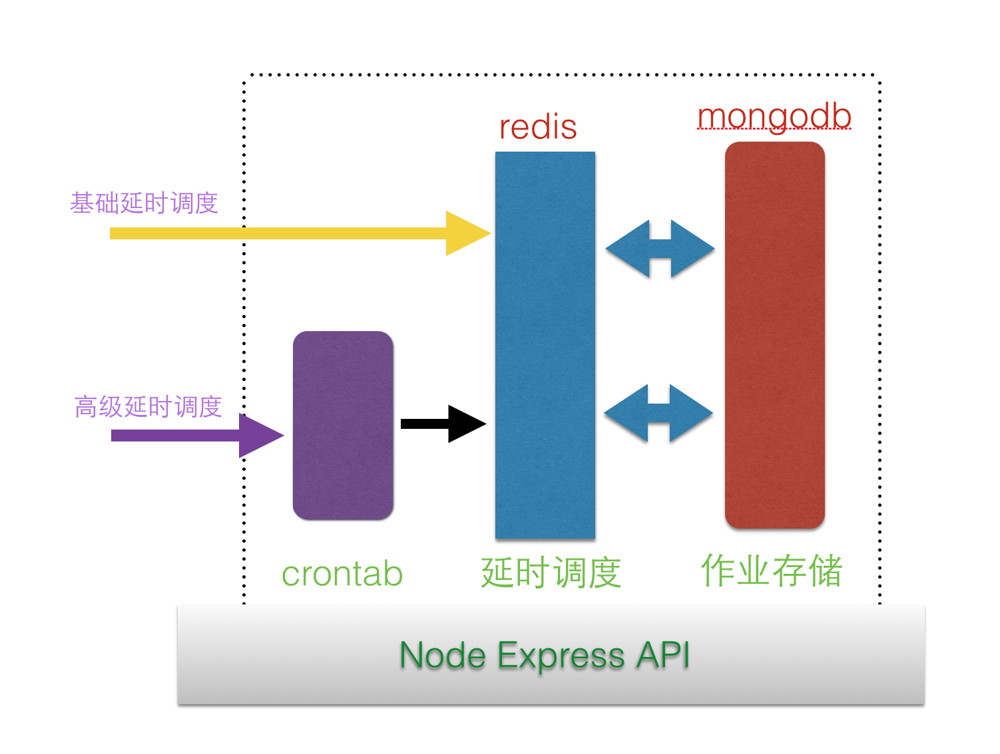

QBaseCron
=========

## tech stack

- express（API）
- redis（任务调度）
- mongodb（存储任务）

## features


## 原理

增加调度，等触发调度的时候，对外发送请求，这样就能够做到通用了





### 阶段1：根据时间，实现基础的延时调度


### 阶段2：引入crontab一样的表达式，支持更多调度

https://github.com/bunkat/later

此时的任务，会发给阶段1的基础延时调度来处理

### 阶段3：触发之后对外发送http请求，此处可以负载

### 总结

通过3个阶段的处理，可以完成大规模的部署


## Table

- _id
- time
- desc
- callback_url
- is_finished
- create_at

情景

2014-11-11 11：10 财神给小墨发送消息

## todo

- [ ] 增加一个调度
- [ ] 移除一个调度
- [ ] 获取调度列表
- [ ] 查看调度详情


## url

- https://github.com/i5ting/redis-scheduler
- http://momentjs.com/
- https://github.com/mikeal/request/
## token


### 定时推送		
http://127.0.0.1:7000/api/v0.1.0/tasks

post

x-www-form-urlencoded

参数

- time = 2014-10-17 20:43:44
- desc = desc
- callback_url = http://127.0.0.1:3000/api/v0.1.0/push/api
- data = eyJ0b2tlbiI6IkIxNTA0RDk5RjBDMERCODA0ODcwOUVDNThCQUNENEExMDU0Q0IzMzFDNTc2MjdBMDQyRTcyQ0UxREZDNjg3M0YiLCJhbGVydCI6Iui

说明：

data是对象，转成string，然后base64获得的。具体算法如下：

```
		var d = { 	token:'B1504D99F0C0DB8048709EC58BACD4A1054CB331C57627A042E72CE1DFC6873F', 	alert:'这是我的消息,你妹啊1211221', 	payload:{     "status": {         "dfsdsf": 0,         "msg": "success"     } }, 	badge:'1' }
		//JSON.stringify(d) = {"token":"B1504D99F0C0DB8048709EC58BACD4A1054CB331C57627A042E72CE1DFC6873F","alert":"这是我的消息,你妹啊1211221","payload":{"status":{"dfsdsf":0,"msg":"success"}},"badge":"1"}

		var a = new Buffer(JSON.stringify(d)).toString('base64');
		// a= eyJ0b2tlbiI6IkIxNTA0RDk5RjBDMERCODA0ODcwOUVDNThCQUNENEExMDU0Q0IzMzFDNTc2MjdBMDQyRTcyQ0UxREZDNjg3M0YiLCJhbGVydCI6Iui/meaYr+aIkeeahOa2iOaBryzkvaDlprnllYoxMjExMjIxIiwicGF5bG9hZCI6eyJzdGF0dXMiOnsiZGZzZHNmIjowLCJtc2ciOiJzdWNjZXNzIn19LCJiYWRnZSI6IjEifQ==
```

### 实时推送


http://127.0.0.1:3000/api/v0.1.0/push

x-www-form-urlencoded

参数

- token = B1504D99F0C0DB8048709EC58BACD4A1054CB331C57627A042E72CE1DFC6873F
- alert = 这是我的消息,你妹啊1211221
- payload = {     "status": {         "dfsdsf": 0,         "msg": "success"     } }
- badge = 0


